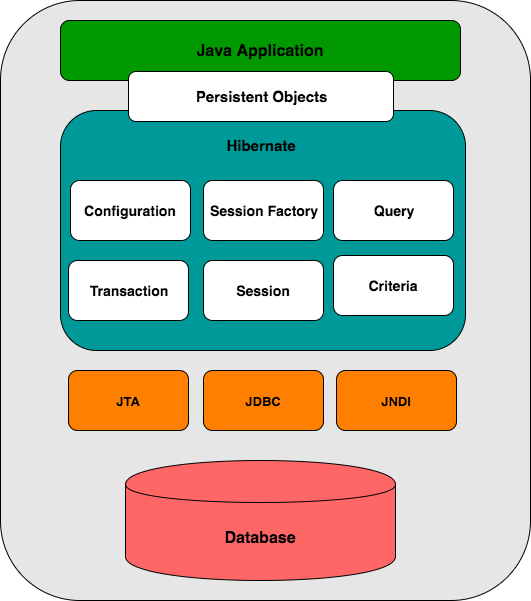

# Java Persistence API with Hibernate

### 1. Java Persistence API
#### 1.1 Overview
* Mapping Java objects to database tables and vice versa is called **Object-relational mapping (ORM)**. The Java Persistence  API is one of approaches for ORM. Using JPA developer can map, update, store and retrieve Java objects from relational database and vice versa.
* JPA is the specification and there are many implementations such as Hibernate, EclipseLink, Apache OpenJPA... The JPA implementaion is usually called Persistence Provider.
* JPA allows developer to work directly with the object rather than the SQL scripts.

#### 1.2 Entity
* A Java class that is pesisted in a database must be annotated with annotation ```javax.persistence.Entity```. Such classes are called Entity. JPA maps a database table for each entity. The pesisted instance of a Java class will be represented as a one row in database table.
* By default the table name is corresponds to the class name. But you can change the table name by using the annotation ```@Table(name="new_table_name")```. 

#### 1.3 Fields
* The fields of the Entity will be saved in database. JPA can access the fields by using instance variables (fields) or the corresponding getters/setters. If you want to use the getters/setters you have to follow the Java Bean convention to create getters/setters.
* By default each field is mapped to a column in database with the field name. But you can change the column name by using the annotation ```@Column(name="new_column_name")```

#### 1.4 Relationship mapping
* With JPA we can define the relationship between classes. Class can have 1:1, 1:N, N:1, and N:N relationships with other class.
* A relationship can be bidirectional or unidirectional. In bidirectional relationship, both classes store the reference to each other. While in unidirectional relationship, only one class holds reference to the other class.
* In bidirectional relationship, we need to specify the owning side of this relationship with attribute ```mappedBy```. For example ```@ManyToMany(mappedBy="attributeOfOwningClass")```
* Relationship annotation
    * ```@OneToOne```
    * ```@OneToMany```
    * ```@ManyToOne```
    * ```@ManyToMany```

#### 1.5 Entity Manager
* The entity manager ```javax.persistence.EntityManager``` provides the operations from and to database. With ```EntityManager``` you can create, read, update, delete object from/to database.
* Entities which is managed by an EntityManager will automatically propagate changes to database (if this happens within a commit statement).


### 2. Hibernate
#### 2.1 Architecture


* Hibernate uses many existing Java API such as **JTA (Java Transaction API)**, **JDBC (Java Database Connectivity)**, **JNDI (Java Naming and Directory Interface)**. JDBC helps us to do some common tasks with relational databases such as open/close connection, query... JTA and JNDI help Hibernate to be integrated with J2EE application server.

* **Configuration Object** is the first object the Hibernate application creates. It's usually creates once during application startup. The configuration object provides two keys components:
    * Database Connection -- provides properties to connect with database such as url, username/password... 
    * Class Mapping Setup -- provides the link between Java classes and database tables.

* **SessionFactory Object**
    * Configuration object is used to create SessionFactory object. And the SessionFactory object will be used to configure Hibernate for the application and to create Session objects.
    * The SessionFactory object is a thread-safe object and is used by all threads in the application.
    * The SessionFactory object is created during application start up. If you use many databases in your application, you need to create SesstionFactory object for each database.

* **Session Object** is used to get a physical connection with database. A Session is designed to be instantiated each time an interaction with database needed. **Persistent objects are saved and retrieved through the Session**. Session objects should not be kept for a long time.

* **Transaction** in Hibernate is handled by underlying transaction manager and transaction (from JDBC and JTA).

* **Query Object** use SQL or HQL (Hibernate Query Language) to retrieve data from database and create objects. A Query instance is used to bind query parameters, limit the number of results and finally execute the query.

* **Criteria Object** are used to create and execute object oriented criteria queries to retrieve objects.

#### 2.2 Configuration
Hibernate requires to know set of configuration settings related to database and where to find mapping between Java classes and database tables. All such information is usually supplied as a standard Java properties file called **hibernate.properties** or a xml file called **hibernate.cfg.xml**.

* **Hibernate properties**<br/>
    The table below contains the most important properties Hibernate needs to know.

   
    | Property | Description |
    | -- |----|
    | hibernate.dialect | This property makes Hibernate generate the appropriate SQL query for the choosen database |
    | hibernate.connection.driver_class | The JDBC Driver class |
    | hibernate.connection.url | The JDBC URL to a database instance |
    | hibernate.connection.username | The database username |
    | hibernate.connection.password | The database password |
    | hibernate.connection.pool_size | Max connections in Hibernate connection pool |
    | hibernate.connection.autocommit | Allow autocommit mode to be used for JDBC connection |
    
* **Hibernate configuration for MySQL example** <br/>
    ```
    <?xml version = "1.0" encoding = "utf-8"?>
    <!DOCTYPE hibernate-configuration SYSTEM 
    "http://www.hibernate.org/dtd/hibernate-configuration-3.0.dtd">
    <hibernate-configuration>
        <session-factory>
            <property name = "hibernate.dialect">
                org.hibernate.dialect.MySQLDialect
            </property>

            <property name = "hibernate.connection.driver_class">
                com.mysql.jdbc.Driver
            </property>
 
            <!-- Assume test is the database name -->
            <property name = "hibernate.connection.url">
                jdbc:mysql://localhost/test
            </property>

            <property name = "hibernate.connection.username">
                root
            </property>

            <property name = "hibernate.connection.password">
                root123
            </property>

            <!-- List of XML map ping files -->
            <mapping resource = "Employee.hbm.xml"/>

        </session-factory>
    </hibernate-configuration>
    ```

#### 2.3 Session
The Session is used to get a physical connection with database. The Session object is instantiated each time an interaction with database needed. **Persistent objects are saved and retrieved through the a Session object.** The Session objects should not be kept for a long time because they are usually thread safe.<br/>
The Session object main functions are create/read/update/delete entities. Entity instances may exist in one of 3 states at a given point in time:
* **transient** -- A new instance of a persistent class, which is not associated with a Session and has no representation in the database.
* **persistent** -- We can make a transient object persistent by associating it with a Session. A persistent object will ha a representation in the database. 
* **detached** -- Once we close the Hibernate Session, the persistent object will become the detached object.<br/>

A typical transaction should use the following idiom:
```
Session session = factory.openSession();
Transaction tx = null;

try {
   tx = session.beginTransaction();
   // do some work
   ...
   tx.commit();
}

catch (Exception e) {
   if (tx!=null) tx.rollback();
   e.printStackTrace(); 
} finally {
   session.close();
}
```

#### 2.4 Persistent Class
The center concept of Hibernate is to take the values of Java object attributes and persist them to database tables and retrieve rows in tables as Java objects. A document mapping helps Hibernate in determining how to pull values from objects and map them with tables and associated fields.<br/>
Java classes who instances will be stored in a database are called persistent classes in Hibernate. Persistent classes have to follow some rules below (but none of them is required):
* All persistent classes need a default constructor
* All persistent classes need a property called ID to allow easy identification with database
* All persistent attributes should be declared ```private``` and have getter/setter follow Java Bean convention (**getXXX/setXXX**)

#### 2.5 Mapping Files
The O/R mappings are defined in an XML document. Hibernate will parse this file to map persistent classes to database tables and vice versa. Below is an example of xml mapping file:

```
<?xml version = "1.0" encoding = "utf-8"?>
<!DOCTYPE hibernate-mapping PUBLIC 
"-//Hibernate/Hibernate Mapping DTD//EN"
"http://www.hibernate.org/dtd/hibernate-mapping-3.0.dtd"> 

<hibernate-mapping>
   <class name = "Employee" table = "EMPLOYEE">
      
      <meta attribute = "class-description">
         This class contains the employee detail. 
      </meta>
      
      <id name = "id" type = "int" column = "id">
         <generator class="native"/>
      </id>
      
      <property name = "firstName" column = "first_name" type = "string"/>
      <property name = "lastName" column = "last_name" type = "string"/>
      <property name = "salary" column = "salary" type = "int"/>
      
   </class>
</hibernate-mapping>
```


#### 2.6 Mapping Types
Hibernate has to map the Java data types to RDBMS types and vice versa. The table below describes corresponding types between Java data types and RDBMS types.

| Java Type | ANSI SQL Type |
| ------ | ------------ |
| int/java.lang.Integer | integer |
| long/java.lang.Long | bigint |
| short/java.lang.Short | smallint |
| float/java.lang.Float | float |
| double/java.lang.Double | double |
| String | varchar |
| boolean/java.lang.Boolean | char(1) ('t' or 'f') |


#### 2.7 Annotations
Hibernate annotation is the newest way to define mappings without using the XML file. You can use annotations in addition to or as a replacement of XML mapping metadata.

* **@Entity Annotation** marks classes as persistent class. With this annotation, the classes must have a default constructor (no-argument constructor).
* **@Table Annotation** allows to specify the details of table that will be used to persist the entity to database. Table annotation provides 4 attributes, allows to override the name of the table, its catalogue, its schema and enforce the unique constraint on columns of the table.
* **@Id and @GeneratedValue Annotations** -- @Id annotation specifies the primary key of entity bean. The primary key can be a single field or a combination of multiple fields.
* **@Column Annotation** specifies the details of column to which the field will be mapped. Below are the most commonly used attributes of @Column annotation:
    * name 
    * length
    * nullable
    * unique
    


#### 2.8 Criteria Queries
Criteria is one way to manipulate objects and in turn data available in RDBMS tables. Criteria API allows us to make criteria query programmatically where we can apply filtration rules and logic conditions. <br/>
The Hibernate Session interface provides method **createCriteria()** to create Criteria object that returns instances of the persistent object's class when we execute criteria query.<br/>
```
Criteria cr = session.createCriteria(Employee.class);
List<Employee> employees = cr.list();
```

* **Restrictions with Criteria** -- We can use the method *add(Criterion)* to add restrictions to Criteria query. Following are the examples of adding restrictions to Criteria query:
    ```
    Criteria cr = session.createCriteria(Employee.class);
    // To get records having salary equal to 2000
    cr.add(Restrictions.eq("salary", 2000));
    
    // To get records having salary more than 2000
    cr.add(Restrictions.gt("salary", 2000));
    
    // To get records having salary less than 2000
    cr.add(Restrictions.lt("salary", 2000));
    
    // To get records having fistName starting with zara
    cr.add(Restrictions.like("firstName", "zara%"));
    
    // Case sensitive form of the above restriction.
    cr.add(Restrictions.ilike("firstName", "zara%"));
    
    // To get records having salary in between 1000 and 2000
    cr.add(Restrictions.between("salary", 1000, 2000));
    
    // To check if the given property is null
    cr.add(Restrictions.isNull("salary"));
    
    // To check if the given property is not null
    cr.add(Restrictions.isNotNull("salary"));
    
    // To check if the given property is empty
    cr.add(Restrictions.isEmpty("salary"));
    
    // To check if the given property is not empty
    cr.add(Restrictions.isNotEmpty("salary"));
    ```
    We can add AND/OR conditions using LogicalExpression restriction to Criteria query. Following is the example of using LogicalExpression:
    ```
    Criteria cr = session.createCriteria(Employee.class);
    
    Criterion salary = Restrictions.gt("salary", 2000);
    Criterion name = Restrictions.ilike("firstNname","zara%");
    
    // To get records matching with OR conditions
    LogicalExpression orExp = Restrictions.or(salary, name);
    cr.add( orExp );
    
    // To get records matching with AND conditions
    LogicalExpression andExp = Restrictions.and(salary, name);
    cr.add( andExp );
    
    List results = cr.list();
    ```

* **Pagination with Criteria** -- Criteria interface provides 2 methods to do pagination:
    * *public Criteria setFirstResult(int first)* -- This method sets the first row in the result set, starting with row 0.
    * *public Criteria setMaxResults(int max)* -- This method sets the page size, the maximun number of objects to get each time.

* **Sorting the Results** -- The Criteria API provide the *org.hibernate.criterion.Order* class to sort the result set arcording to one of properties of the persistent class. Below is the example of using *Order* to sort:
    ```
    Criteria cr = session.createCriteria(Employee.class);
    
    // To get records having salary more than 2000
    cr.add(Restrictions.gt("salary", 2000));
    
    // To sort records in descening order
    crit.addOrder(Order.desc("salary"));
    
    // To sort records in ascending order
    crit.addOrder(Order.asc("salary"));
    
    List results = cr.list();
    ```

* **Projections and Aggregations** -- The Criteria API provide the *org.hibernate.criterion.Projection* which can be used to get average, maximum or minimum of property values. Below is the example of using Projections:
    ```
    Criteria cr = session.createCriteria(Employee.class);

    // To get total row count.
    cr.setProjection(Projections.rowCount());

    // To get average of a property.
    cr.setProjection(Projections.avg("salary"));

    // To get distinct count of a property.
    cr.setProjection(Projections.countDistinct("firstName"));

    // To get maximum of a property.
    cr.setProjection(Projections.max("salary"));

    // To get minimum of a property.
    cr.setProjection(Projections.min("salary"));

    // To get sum of a property.
    cr.setProjection(Projections.sum("salary"));
    ```


#### 2.9 Caching
