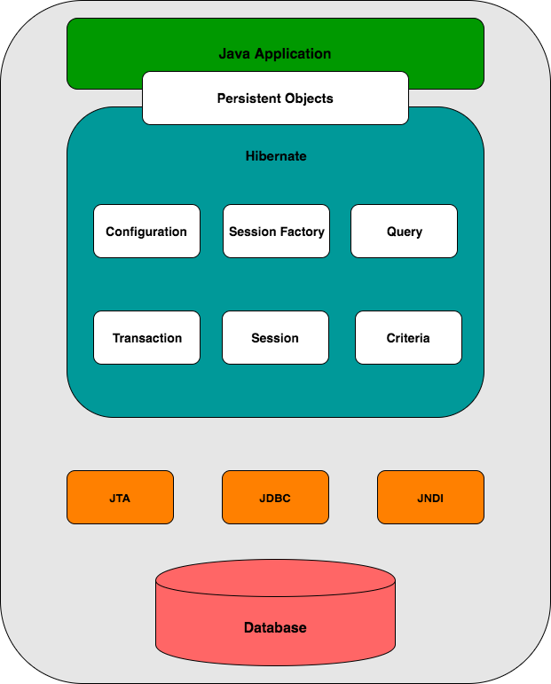

# Java Persistence API with Hibernate

### 1. Java Persistence API
#### 1.1 Overview
* Mapping Java objects to database tables and vice versa is called **Object-relational mapping (ORM)**. The Java Persistence  API is one of approaches for ORM. Using JPA developer can map, upadte, store and retrieve Java objects from relational database and vice versa.
* JPA is the specification and there are many implementations such as Hibernate, EclipseLink, Apache OpenJPA... The JPA implementaion is usually called Persistence Provider.
* JPA allows developer to work directly with the object rather than the SQL scripts.

#### 1.2 Entity
* A Java class that is pesisted in a database must be annotated with annotation ```javax.persistence.Entity```. Such classes are called Entity. JPA maps a database table for each entity. The pesisted instance of a Java class will be represented as a one row in database table.
* By default the table name is corresponds to the class name. But you can change the table name by using the annotation ```@Table(name="new_table_name")```. 

#### 1.3 Fields
* The fields of the Entity will be saved in database. JPA can access the fields by using instance variables (fields) or the corresponding getters/setters. If you want to use the getters/setters you have to follow the Java Bean convention to create getters/setters.
* By default each field is mapped to a column in database with the field name. But you can change the column name by using the annotation ```@Column(name="new_column_name")```

#### 1.4 Relationship mapping
* With JPA we can define the relationship between classes. Class can have 1:1, 1:N, N:1, and N:N relationships with other class.
* A relationship can be bidirectional or unidirectional. In bidirectional relationship, both classes store the reference to each other. While in unidirectional relationship, only one class holds reference to the other class.
* In bidirectional relationship, we need to specify the owning side of this relationship with attribute ```mappedBy```. For example ```@ManyToMany(mappedBy="attributeOfOwningClass")```
* Relationship annotation
    * ```@OneToOne```
    * ```@OneToMany```
    * ```@ManyToOne```
    * ```@ManyToMany```

#### 1.5 Entity Manager
* The entity manager ```javax.persistence.EntityManager``` provides the operations from and to database. With ```EntityManager``` you can create, read, update, delete object from/to database.
* Entities which is managed by an EntityManage will automatically propagate changes to database (if this happens within a commit statement).


### 2. Hibernate
#### 2.1 Architecture


* Hibernate uses many existing Java API such as **JTA (Java Transaction API)**, **JDBC (Java Database Connectivity)**, **JNDI (Java Naming and Directory Interface)**. JDBC helps us to do some common tasks with relational databases such as open/close connection, query... JTA and JNDI help Hibernate to be integrated with J2EE application server.
* **Configuration** Object is the first object the Hibernate application creates. It's usually creates once during application startup. The configuration object provides two keys components:
    * Database Connection -- provides properties to connect with database such as url, username/password... 
    * Class Mapping Setup -- provides the link between Java classes and database tables.
* **SessionFactory Object**
    * Configuration object is used to create SessionFactory object. And the SessionFactory object will be used to configure Hibernate for the application and to create Session objects.
    * The SessionFactory object is a thread-safe object and is used by all threads in the application.


#### 2.2 Configuration

#### 2.3 Session

#### 2.4 Persistent Class

#### 2.5 Mapping Files

#### 2.6 Mapping Types
