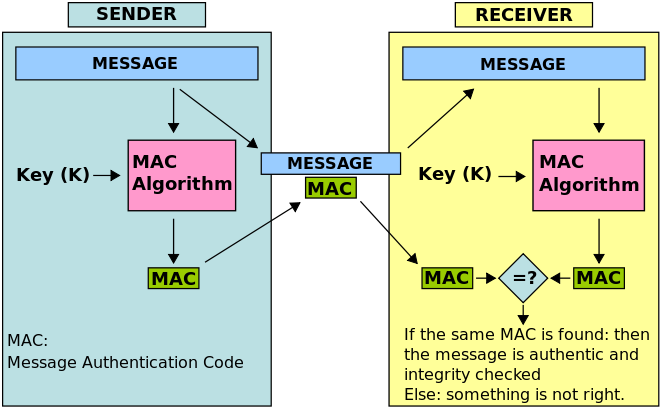

# Security

### 1. Asymmetric (public key) encryption and digital signature
    First, note that, here I just provide an abstraction about public key encryption to understand
    something (concepts) below (like JSON Web Token). To fully understand this topic I will 
    study *cryptography* in another github repository(course).
    
    Asymmetric encryption is based on a pair of public/private key. Unlike symmetric encrytion 
    there is only one key and both sides must keep it secret.

#### 1.1 Public key encryption
* Let say that Alice wants to send some messages to Bob and she does not want anybody can read them except Bob. Bob will generate a *pair of public/private key*. Bob gives *public key* to Alice and keep *private key* secret. Now Alice is going to use *public key* to encrypt the message and send it to Bob. Bob will use *private key* to decrypt Alice's message. And only Bob can do that.
* Look at the image below for more visual


#### 1.2 Digital signature
* Let say that, Bob wants to send message to Alice and Alice wants to make sure that the message is Bob's. Before sending Bob will *sign* the message using *private key*. Alice receives the message and uses the *public key* to verify that Bob created this message. Or anyone has *public key* can verify if Bob created message.

#### 1.3 Message authentication code (MAC)
* MAC algorithm is a symmetric key cryptographic technique to provide message authentication. The sender and receiver share a private symmetric key called K.
* The image below describes how MAC works


#### 1.4 HTTPS
It's vital to understand what HTTPS is and how it works. So I will present it in a separate file. [Go to https](https.md).

### 2. Cookie-based vs token-based authentication

#### 2.1 Cookie-based authentication
* Cookie-based authentication is **stateful**. Meaning that an authentication record(session) must be kept on both client side and server side
* Flow of cookie-based auth
    * User posts credentials to server
    * Server verify credentials and create session which is stored on db
    * A cookie with the **session ID** is placed in user browser
    * On subsequence requests, user must post session ID to server and it will be verified against db
    * Once user logouts the session will be destroyed on both side, client and server


#### 2.2 Token-based authentication
* Token-based authentication is **stateless**. Meaning that server does not keep a record of which users logged in or which tokens issued.
* Flow of token-based authentication
    * User posts credentials to server
    * Server verifies credentials are correct and return a *signed token*
    * This token is stored only on client side
    * On subsequence requests, user must include this token to *Authorization* header
    * Server decode token and verifies if it **signed** this token and then process the request
    * Once the user logouts, the token is destroyed on client side, no interaction with server is necessary
    
    
#### 2.3 Advantages of token-based authentication
* Because token-based authentication is **stateless** so it helps to *scale* the server easily. It also helps to *decouple* client and server. 

### 3. JSON Web Token (JWT)
JSON Web Token is a open, industry standard [RFC 7519](https://tools.ietf.org/html/rfc7519) method for representing claims securely between two parties. JWT contains 3 pieces separated by dot character (*xxx.yyy.zzz*). They are header, payload and signature respectively. JWT can be signed using a secret (**HMAC** algorithm) or a pair of private/public key (**RSA**). Because of that the JWT can be verified and trusted between parties.
* **Header**
    * Consists 2 parts: type of token (which is JWT) and signature algorithm
    * Example
    ``` JSON
    {
        "alg": "HS256",
        "typ": "JWT"
    }
    ```
        
* **Payload**
    * Contains claims (statement about an entity typically an user or anything we want to transfer between parties)
    * Example
    ``` JSON
    {
        "username": "Tam-CO",
        "user_id": "1234567890",
        "super_dev": true
    }
    ```
    
* **Signature**
    * Sign on a combination of header and payload
    * Example
    ``` java
    HMACSHA256(
  base64UrlEncode(header) + "." +
  base64UrlEncode(payload),
  secret)
    ````


### 4. Spring security

### 5. Single sign on (SSO)
* Login one time access to serveral services
* Centralize identity (known as *federated identity*). Federated identity systems handle
serveral concerns:
    * **Authentication** deals with validating user credentials and establishing the identity of the user
    * **Authorization** is related to access restrictions (e.g is the user **allowed** to access resource X?)
    * **User attributes exchange** deals with data sharing across different user management systems
    * **User management** is related to administration (creation, deletion, update) of user accounts

### 6. OAuth2
#### 6.1 Roles
* **Resource owner** is an entity capable of granting access to a protected resource. When resource owner is a person, it is referred as an end-user.
* **Resource server** is the server hosting protected resources, capable of accepting and responding protected resource requests using access token.
* **Client** is the third party. It is an application attempting to access resource owner's protected resource. It needs to get permission from resource owner before accessing protected resource.
* **Authorization server** is the server issuing access token to client after authenticating resource owner and obtaining authorization. 

#### 6.2 Protocol Flow
     +--------+                               +---------------+
     |        |--(A)- Authorization Request ->|   Resource    |
     |        |                               |     Owner     |
     |        |<-(B)-- Authorization Grant ---|               |
     |        |                               +---------------+
     |        |
     |        |                               +---------------+
     |        |--(C)-- Authorization Grant -->| Authorization |
     | Client |                               |     Server    |
     |        |<-(D)----- Access Token -------|               |
     |        |                               +---------------+
     |        |
     |        |                               +---------------+
     |        |--(E)----- Access Token ------>|    Resource   |
     |        |                               |     Server    |
     |        |<-(F)--- Protected Resource ---|               |
     +--------+                               +---------------+

#### 6.3 Register an app
Before you can begin OAuth process, you must first register an application with the service. In addition you must register ridirect URI with the service.
* Client ID and Client Secret
After registering your app, you will receive a Client ID and a Client Secret. Client ID can be public and Client Secret must keep confidential. If your deployed app cannot keep the secret confidential, such as single page Javascript app or mobile native app, the Client Secret is not used.

#### 6.4 Authorization

### 7. OpenID Connect
#### 7.1 Overview
* OpenID Connect = OAuth2 + ID Token (JWT)
* OpenID Connect is a simple identity layer on top of the OAuth2 protocol. It enables Clients to verify the identity of End-User based on the authentication performed by an Authorization Server, as well as to obtain basic profile information about the End-User in an interoperable and REST-like manner.
* OpenID Connect core functionalities: authentication built on top of OAuth2 + the use of Claims to communicate information about the End-User.
* The OpenID Connect protocol, in abstract, follows the following steps
    ``` java
    1. The RP (Client) sends a request to the OpenID Provider (OP).
    2. The OP authenticates the End-User and obtains authorization.
    3. The OP responds with an ID Token and usually an Access Token.
    4. The RP can send a request with the Access Token to the UserInfo Endpoint.
    5. The UserInfo Endpoint returns Claims about the End-User.
    ```
    ``` java
    +--------+                                   +--------+
    |        |                                   |        |
    |        |---------(1) AuthN Request-------->|        |
    |        |                                   |        |
    |        |  +--------+                       |        |
    |        |  |        |                       |        |
    |        |  |  End-  |<--(2) AuthN & AuthZ-->|        |
    |        |  |  User  |                       |        |
    |   RP   |  |        |                       |   OP   |
    |        |  +--------+                       |        |
    |        |                                   |        |
    |        |<--------(3) AuthN Response--------|        |
    |        |                                   |        |
    |        |---------(4) UserInfo Request----->|        |
    |        |                                   |        |
    |        |<--------(5) UserInfo Response-----|        |
    |        |                                   |        |
    +--------+                                   +--------+
    ```
    [Reference 1](https://openid.net/specs/openid-connect-core-1_0.html)
    [Reference 2](https://www.youtube.com/watch?v=6DxRTJN1Ffo)
#### 7.2 Concepts
* ID Token is a JWT contains Claims
* Endpoints are the interfaces which Client and End-User interact with OP. They are:
    * Authorization Endpoint
    * Token Endpoint
    * UserInfo Endpoint
* Claims are *statements about an entity typically an user or anything we want to transfer between parties*. Claims include: *sub, name, given_name, family_name, middle_name, preferred_username, nickname, profile, picture, website, email, blah blah blah*
#### 7.3 Flows
* [Authorisation code flow](https://openid.net/specs/openid-connect-core-1_0.html#CodeFlowAuth)
    ```
    *response_type* == *code*
    ```
    ``` java
    1. Client prepares an Authentication Request containing the desired request parameters.
    2. Client sends the request to the Authorization Server.
    3. Authorization Server Authenticates the End-User.
    4. Authorization Server obtains End-User Consent/Authorization.
    5. Authorization Server sends the End-User back to the Client with an Authorization Code.
    6. Client requests a response using the Authorization Code at the Token Endpoint.
    7. Client receives a response that contains an ID Token and Access Token in the response body.
    8. Client validates the ID token and retrieves the End-User's Subject Identifier.
    ```
* [Implicit flow](https://openid.net/specs/openid-connect-core-1_0.html#ImplicitFlowAuth)
    ```
    *response_type* == *token* or *id_token* or both
    ```
    ``` java
    1. Client prepares an Authentication Request containing the desired request parameters.
    2. Client sends the request to the Authorization Server.
    3. Authorization Server Authenticates the End-User.
    4. Authorization Server obtains End-User Consent/Authorization.
    5. Authorization Server sends the End-User back to the Client with an ID Token and, if requested, an Access Token.
    6. Client validates the ID token and retrieves the End-User's Subject Identifier.
    ```
* [Hybrid flow](https://openid.net/specs/openid-connect-core-1_0.html#HybridFlowAuth)
    ``` java
    1. Client prepares an Authentication Request containing the desired request parameters.
    2. Client sends the request to the Authorization Server.
    3. Authorization Server Authenticates the End-User.
    4. Authorization Server obtains End-User Consent/Authorization.
    5. Authorization Server sends the End-User back to the Client with an Authorization Code and, depending on the Response Type, one or more additional parameters.
    6. Client requests a response using the Authorization Code at the Token Endpoint.
    7. Client receives a response that contains an ID Token and Access Token in the response body.
    8. Client validates the ID Token and retrieves the End-User's Subject Identifier.
    ```
