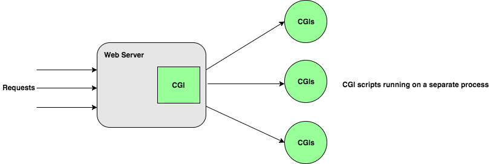
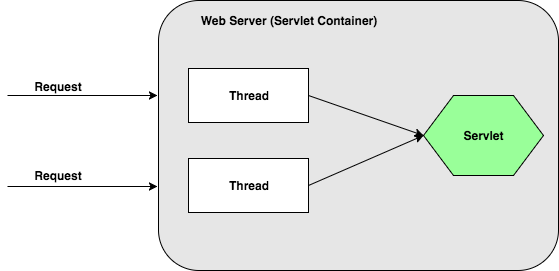
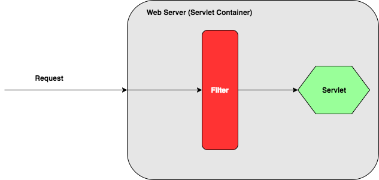

# Servlet

### 1. What is Servlet
To understand servlet we need to understand *Web Server* and *CGI (Common Gateway Interface)*.

* **Web Server** is a (system of) software running on a server listen on default port 80 (maybe other port) to handle http requests and return http responses to client. In the other words, Web server is a program that implement HTTP protocol on server side.

* **CGI** offers a standard protocol for web servers to execute programs that execute like Console applications (also called Command-line interface programs) running on a server that generates web pages dynamically. Such programs are known as CGI scripts or simply as CGIs. As the name reveals, CGI acts as "gateway" between Web Server and the programs that generate dynamic web pages. When a http request comes to web server, it will parses request and pass parameters to CGI to trigger the program that generates response. <br/><br/>


* **CGI's drawbacks**
    * For each requests it starts a new process (CGI script) and Web server is limited to start process
    * If the number of clients increases it takes more time to response
    * Platform dependent

* **Servlet** is a Java program that extends capabilities of a server. Although servlets can respond to any type of requests [they most commonly implement application hosted on Web server](https://en.wikipedia.org/wiki/Java_servlet) (HTTP Servlet). As I understand it's a replacement of CGI. Servlet's functionality is similar to CGI that is generating response for client. But servlet does not run on a separate process, it runs under Web server's process.<br/><br/>


* **Advantages of Servlet**
    * Better performance because it starts a thread for each requests instead of process
    * Portability because it's Java program

### 2. Tomcat
* **Tomcat** is a Web server that implements Java Servlet specification. So it's also a Servlet Container.
* **Components**
    * **Catalina** is Tomcat's servlet container. Catalina implements Sun Microsystem's specifications for Java servlet and JavaServer Page (JSP).
    * **Coyote** is a Connector component for Tomcat that supports HTTP 1.1 protocol as a Web server. It listens for incoming connections to the server on a specific TCP port and forwards the request to the Tomcat Engine to process the request and send back a response to the requesting client.
* **Web Application Structure on Tomcat**
    ```
    tc/webapps/application-name|
                               |________ static_resouces(images, css...)
                               |________ html_and_jsp_files
                               |________ WEB-INF|
                                                |________ lib
                                                |________ web.xml
                                                |________ classes (Java classes, Servlet classes)
    ```
    
    web.xml is called Deployment Descriptor. It describes servelets and other components that make up the servlet application. Below is an sample of deployment descriptor:
    
    ```
    <?xml version="1.0" encoding="UTF-8" ?>
        <web-app
            version="3.0"
            xmlns="http://java.sun.com/xml/ns/javaee"
            xmlns:xsi="http://www.w3.org/2001/XMLSchema-instance"
            xsi:schemaLocation="http://java.sun.com/xml/ns/javaee http://java.sun.com/xml/ns/javaee/web-app_3_0.xsd">


            <servlet>
                <servlet-name>tamco</servlet-name>
                <servlet-class>com.tamco.servlet.TamCoServlet</servlet-class>
            </servlet>

            <servlet-mapping>
                <servlet-name>tamco</servlet-name>
                <url-pattern>/hello</url-pattern>
            </servlet-mapping>
    </web-app>
    ```

### 3. How Servlet works
* Client sends request **GET /hello** to Web server (Servlet Container)

* The Servlet Container finds the servlet to serve request by looking at deployment descriptor. And it finds servlet **tamco**. If this is the first time the servlet **tamco** is used, it will be loaded from class file and initialized.

* The Servlet Container creates 2 objects **HttpServletRequest** and **HttpServletResponse**. Then it will allocate a thread to call method **service** of the servlet **tamco** to serve the request.
    ```
    tamco.service(httpServletRequest, httpServletResponse);
    ```
    
* Servlet **tamco** then decides which method to call (doGet, doPost...) based on HTTP Request Method.

* Servlet **tamco** uses httpServletResponse to write response to client.

* After the method **service()** is completed the thread dies and 2 objects (request and response) are destroyed.

### 4. Filter
* Filters are components to perform some filtering tasks.
* Filter is used for pre-processing of servlet requests and post-processing of servlet responses.
* Filters are configured in deployment descriptor.<br/><br/>


### 5. Session Management
